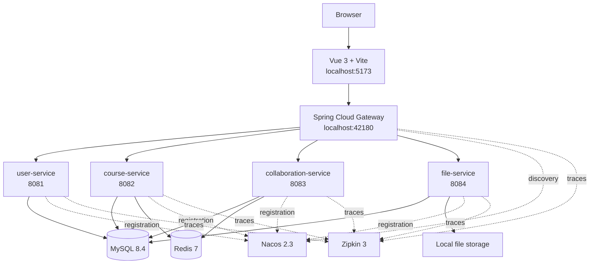

# Course Collaboration Platform

A role-aware course workspace built for a combined JavaEE and database systems project at Shanghai University of Electric Power (SHIEP). The platform brings course administration, teaching content, assignments, project collaboration, and operational audit data into one application.

The repository contains a Vue frontend, a Spring Cloud backend split into four domain services, a gateway, and a MySQL-first data layer. Local development keeps infrastructure in Docker while running Java services directly through Maven, which avoids rebuilding backend images during normal iteration.

## Features

- Course workspaces with members, notices, categorized resources, and tags
- Assignment publishing, attachment handling, submissions, resubmissions, grading, and feedback
- Project groups with join/leave flows, member lists, and group-scoped discussions
- Project showcase entries with links or managed file attachments
- Separate system and course roles for administrators, teachers, teaching assistants, and students
- Admin views for user management, course statistics, operation history, and file lifecycle inspection
- File preview and download flows with SHA-256 deduplication
- Reference-aware file release with a database queue, delayed garbage collection, retry state, and manual collection
- Nacos service discovery, Redis-backed coordination and caching, and Zipkin distributed tracing

## Role Model

System identity and course identity are evaluated separately. A user's global role controls system-level access, while their membership in each course determines what they can do inside that course.

For example, the seeded `ta1` account is a teaching assistant in the JavaEE course but a student in the database course. The frontend refreshes the available actions whenever the active course changes, and the backend performs the same checks before executing protected operations.

| Course role | Typical access |
| --- | --- |
| Teacher | Manage course settings and members; publish and grade course content |
| Teaching assistant | Publish notices, resources, and assignments; grade work; manage project collaboration |
| Student | Submit assignments, join or create groups, participate in discussions, and publish showcases |
| Administrator | Manage users and courses, inspect statistics and audit records, and operate across course boundaries |

## Architecture



All browser API requests use the `/api` prefix. The gateway validates the JWT and routes requests through Nacos service discovery:

| Route group | Service |
| --- | --- |
| `/api/auth`, `/api/users` | `user-service` |
| `/api/courses`, `/api/notices`, `/api/resources`, `/api/assignments`, `/api/submissions`, `/api/stats` | `course-service` |
| `/api/projects`, `/api/discussions`, `/api/showcases` | `collaboration-service` |
| `/api/files` | `file-service` |

## Technology

| Area | Stack |
| --- | --- |
| Backend | Java 17, Spring Boot 3.2, Spring Cloud 2023, Spring Cloud Alibaba, OpenFeign |
| Persistence | MySQL 8.4, MyBatis-Plus, database views, stored procedures, and triggers |
| Coordination | Redis 7, Nacos 2.3 |
| Observability | Micrometer Tracing, Zipkin 3, Spring Boot Actuator |
| Frontend | Vue 3, TypeScript, Vite 7, Element Plus, Axios, Day.js |
| Tooling | Maven, Bun, Docker Compose, tmux |

## Database Design

The database is part of the application design rather than a passive CRUD store. The SQL layer currently defines:

- 15 tables with primary keys, foreign keys, unique constraints, check constraints, and supporting indexes
- 3 views: course overview, assignment submission statistics, and file resource status
- 2 stored procedures: course activity statistics and file garbage-collection statistics
- 5 triggers for resource changes, grading, resubmission, project membership, and file-reference release

The complete conceptual model is available as an editable [Chen E-R diagram](database/course-platform-chen-er.drawio).

### File lifecycle

Uploaded files are stored once per SHA-256 hash and size. Business records do not own the physical file directly; `file_reference` records which resource, assignment, submission, or showcase currently uses it.

When a reference is logically deleted, `trg_file_reference_release_queue` writes a candidate to `file_gc_queue`. The file service later processes the queue and checks the active reference count again before deleting physical content. A file that is still referenced is retained, while failed deletion attempts keep their error and retry state. This keeps database state and filesystem cleanup coordinated without letting a database trigger perform operating-system file deletion.

The relevant scripts are applied in this order:

```text
database/schema.sql
database/views.sql
database/procedures.sql
database/triggers.sql
database/data.sql
```

## Local Development

### Prerequisites

- JDK 17
- Maven 3.9 or later
- Bun
- Docker with Docker Compose
- tmux
- curl

### Start

```bash
git clone https://github.com/Yan233th/SHIEP-Course-Collaboration-Platform.git
cd SHIEP-Course-Collaboration-Platform
./scripts/local-dev.sh
```

The script starts MySQL, Redis, Nacos, and Zipkin in Docker. Backend services run directly with `mvn spring-boot:run`, and the frontend runs with Bun and Vite. Each process is placed in an isolated tmux server.

| Endpoint | Address |
| --- | --- |
| Frontend | <http://localhost:5173> |
| API gateway | <http://localhost:42180> |
| Nacos console | <http://localhost:8848/nacos/> |
| Zipkin | <http://localhost:9411> |
| MySQL | `localhost:42033` |
| Redis | `localhost:6379` |

Attach to the service session:

```bash
tmux -L course-platform attach -t course-platform
```

Stop application services while keeping infrastructure data:

```bash
./scripts/local-dev-down.sh
```

Stop both the application and its infrastructure containers:

```bash
./scripts/local-dev-down.sh --with-infra
```

Runtime logs, Nacos client state, Sentinel state, and uploaded files stay under `.runtime/<service>/`. The directory is ignored by Git.

### Default accounts

All seeded accounts use the password `123456`.

| Username | System role | Seeded course membership |
| --- | --- | --- |
| `admin` | Administrator | Global access |
| `teacher1` | Teacher | Teacher in the JavaEE and database courses |
| `ta1` | Teaching assistant | Teaching assistant in JavaEE; student in database design |
| `student1` | Student | Student in JavaEE and database design |
| `student2` | Student | Student in JavaEE |

These accounts are demonstration data and should not be used in a public deployment.

### Inspect MySQL

```bash
docker compose -p course-collab -f deploy/docker-compose.yml exec mysql \
  mysql -uroot -proot123 course_collab
```

Example queries:

```sql
SELECT * FROM v_course_overview;
CALL sp_course_activity_stats(1);
SELECT * FROM audit_history ORDER BY create_time DESC;
SELECT * FROM v_file_resource_status;
```

## Full Container Deployment

The complete stack can also run through Docker Compose:

```bash
docker compose -p course-collab -f deploy/docker-compose.yml up --build
```

The frontend is exposed on <http://localhost:5173>, with Nginx forwarding `/api` requests to the containerized gateway. The gateway is also exposed directly on port `42080`.

```bash
docker compose -p course-collab -f deploy/docker-compose.yml down
```

MySQL and uploaded files use named Docker volumes. Database initialization scripts run when the MySQL volume is created for the first time.

## Build Checks

```bash
cd backend
mvn test

cd ../frontend
bun install --frozen-lockfile
bun run build
```

The frontend API target can be changed at startup without editing source files:

```bash
VITE_API_PROXY=http://localhost:42180 bun run dev
```

## Repository Layout

```text
backend/
  common/                  Shared API, authentication, and runtime support
  gateway/                 JWT validation and service routing
  user-service/            Authentication, profiles, users, and menus
  course-service/          Courses, members, notices, resources, and assignments
  collaboration-service/   Groups, discussions, and showcases
  file-service/            Storage, references, preview, download, and garbage collection
frontend/                  Vue 3 application
database/                  Schema, views, procedures, triggers, seed data, and seed files
deploy/                    Dockerfiles, Compose stack, and Nginx configuration
scripts/                   Local tmux-based development lifecycle
```

## License

This project is licensed under the [GNU Affero General Public License v3.0](LICENSE).
